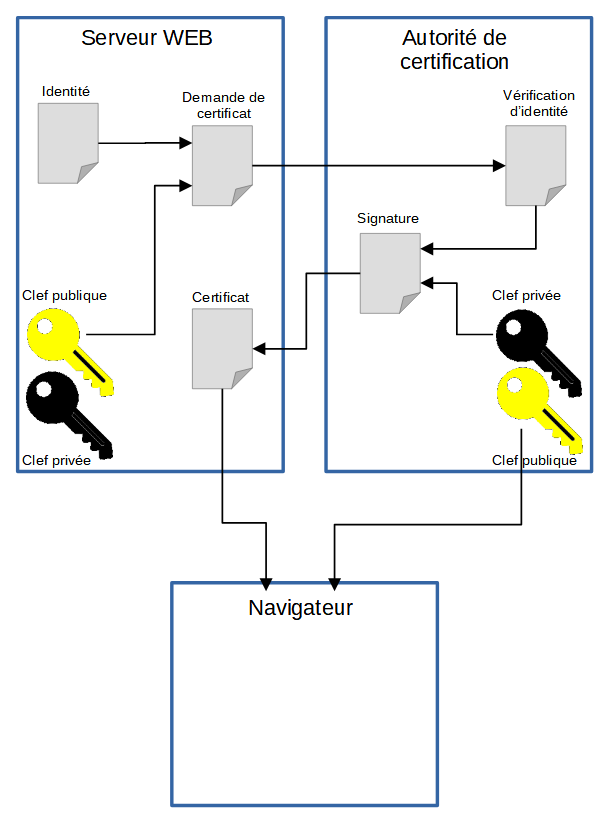

# Couche 7 : Application

## DHCP (Dynamic Host Configuration Protocol)

Le DHCP permet l'attribution automatique de la configuration réseau au démarrage d'une machine.

Elle se fait en plusieurs étapes : 
- DHCP DISCOVER : Le client émet une requête DHCP de demande d'adresseIP en broadcast uniquement sur le réseau local.
- DHCP OFFER : Un serveur DHCP à l'écoute sur le port UDP 67 répond en offrant une adresse IP disponible.
- DHCP REQUEST :le client sélectionne la 1ère réponse reçue et demande l'utilisation de cette adresse au serveur DHCP. 
Ce broadcast permet aussi de prévenir les serveurs DHCP non choisis afin qu'ils puissent libérer les adresses proposées.
- DHCP ACK : Le serveur DHCP accuse réception et accorde l'adresse IP pour une durée déterminée (bail). Ce message peut aussi contenir des paramètres de configuration supplémentaires (passerelle, serveur DNS...)

Un serveur DHCP est personnalisable avec plusieurs options :
  - La durée du bail
  - La plage d'IP disponible
  - L'adresse de la passerelle
  - L'adresse du serveur DNS (ou des serveurs DNS)
  - L'adresse du serveur PXE,s'il y en a un pour le déploiement automatisé.

## DNS (Domaine Name Service)

Le DNS est une base de donnée distribuée accessible via un système de client-serveur. Cette base de donnée contient les correpondances IP - nom de domaine des sites internet.

Le système est basée sur une hierarchie de noms de domaines partant d'une racine, représenté par un point , qui n'apparait que dans la configuration des serveurs DNS.
On trouve ensuite au 1er niveau les TLD (Top Level Domains) qui sont gérés par l'ICANN. À partir de ces TLD, on va trouver les domaines inférieurs et sous-domaines dont la gestion est décentralisée.

Dans un réseau privé, il est possible d'utiliser un DNS local qui est un mirroir d'un DNS extérieur avec en plus des règles personnalisées pour avoir des noms pour les serveurs locaux.

### Les serveurs racines (Root Servers)
Les serveurs DNS racines gèrent les délégations pour les noms de domaine de premier niveau (TLD). 
Il existe 13 groupes de serveurs racines, pour des raisons de fiabilité et de performance. Chaque groupe est un ensemble de serveurs DNS.

## HTTP (HyperText Transfer Protocol)

Le protocole HTTP est basé sur un principe requête/réponse :
- HTTP Request : Un client établit une connexion TCP vers un serveur (pardéfaut sur le port 80) et lui envoie une requête sous la forme d'une méthodee d'une URI, d'un protocole, suivi d'un message
- HTTP Response : Le serveur répond, au travers de la connexion TCP ouverte par le client, par une ligne d'état, incluant la version de protocole et un message de succès ou d'erreur, suivi d'un message contenant l'information souhaitée.

### La requête HTTP
Une requête HTTP consiste en une phrase comportant certains éléments :
  - Une méthode, elle peut être GET, HEAD, POST
    - GET : pour récupérer une ressource
    - HEAD : pareil que GET sauf qu'elle ne demande que la transmission de l'entête de la ressource (Taille d'un fichier avant téléchargement par exemple)
    - POST : utilisée pour indiquer au serveur de soumettre l'entité contenue dans le message à la ressource identifiée par l'URI-visée.
    - D'autres méthodes existent, mais sont moins utilisées sur les sites ordinaires.
  - Une URI
    - L'URI est l'identifiant de la ressource , dans le cas d'un serveur il s'agit du chemin vers la ressource.
  - Un protocole ainsi que sa version

Exemple :
  GET /pub/WWW/index.html HTTP/1.0
  - GET : Methode
  - /pub/WWW/index.html : chemin de la ressource
  - HTTP/1.0 : protocole et version du protocole

### La réponse HTTP

Une fois la requête reçue et interprétée, le serveur répond par un message HTTP. 
La première ligne d'une réponse HTTP contient une phrase avec plusieurs éléments : 
  - Le protocole et sa version
  - Un code de réponse
  - Un message décrivant la raison de ce code.

Les codes de retour sont rangés par catégories :
  - 1xx - Information : Non utilisé, pour usage futur
  - 2xx - Succès : L'action a été correctement reçue, interprétée, et exécutée.
  - 3xx - Redirection : Une décision supplémentaire doit être prise pour terminer la requête
  - 4xx - Erreur Client : La requête présente une erreur de forme et ne peut être satisfaite
  - 5xx - Erreur Serveur : La requête est valide, mais le serveur ne peut la satisfaire

Exemple :
  - HTTP/1.1 200 Ok
  - HTTP/1.1 404 Not Found

### Les entêtes 
Elle permettent au client et au serveur de transmettre des informations supplémentaires avec la requête ou la réponse.

Elles ne sont pas visibles dans le code de la page, mais elles sont interprétées par le client ou le serveur.

### Sécurité 
HTTP circule en clair sur le réseau, n'importe qui peut intercepter les données.
HTTPS permet d'échanger des informations confidentielles, ce n'est pas un nouveau protocole en tant que tel mais l'utilisation du HTTP avec une couche sécurisée SSL .
Le port par défaut est le 443.
### Certificats : 
HTTPS utilise des certificats qui sont authentifés par des autorités de Certification qui signent le certificat. Le navigateur vérifie l'authenticité du certificat lors de son usage.

## FTP (File Transfer Protocol)
Le FTP permet de transférer des fichiers d'une machine à l'autre. Le FTP utilise les ports 21 (canal de commande) et 20 (canal de données). 

Le FTP n'est pas sécurisé, le nom d'utilisateur et mot de passe sont envoyés en clair. 

Il possède deux modes de fonctionnement : 
  - Actif :
    - La machine contacte le serveur pour lui demander un fichier
    - Le serveur crée un canal de données (port 21 pour les commandes et 20 pour les données)
    - Inconvénient, la majorité des pare-feux ne laissent pas passer les communications entrantes pour raison de sécurité.  
  - Passif:
    - La machine contacte le serveur et lui envoie une commande PASV.
    - Le serveur répond en annonçant l'IP et le port à contacter pour les données
    - La machine crée le canal de données vers le serveur : port 21 et un port au choix déterminé par la machine.
    - Avantages: Comme c'est le client qui contacte le serveur, le pare-feux ne bloque pas la communication.
   
  ### Sécurité 
  Le FTP n'est pas sécurisé mais il peut l'être avec l'utilisation de certificat et du SSL (FTPS). 

  Pour le transfert de fichier le HTTPS et SFTP sont utilisés plutôt que le FTPS.
  Attention : SFTP n'est pas FTPS 
     - SFTP : protocole différent basé sur SSH.
     - FTPS : FTP avec surcouche SSL.
     
## SMTP / POP3 / IMAP
Principe de fonctionnement :
  - La messagerie utilise plusieurs protocoles différents pour fonctionner.
  - La partie acheminement des messager est effectuée grâce au protocole SMTP, jusqu'à la boite aux lettre du destinataire.
  - La partie récupération des messages dans la boite aux lettre est confiée aux protocoles POP3 ou IMAP.

### SMTP (Simple Mail Transfer Protocol)
Permet de transférer en connexion point à point, le courrier électronique d'un serveur à un autre (utilisé également par le client pour envoyer un courriel).

SMTP fonctionne en mode connecté (TCP) en utilisant par défaut le port 25.

Le SMTP est un protocole en clair. Toutes les informations sont lisibles.

Il existe deux manières de protéger les informations :
  - Le SMTP Normal sur le port 143, en utilisant la commande STARTTLS
  - Le SMTPS sur le port 993 qui utilise directement le SSL/TLS

Authentification
  - Le protocole SMTP ne garantie ni la provenance du message, ni la réception par le destinataire.
  - Pour savoir si le destinataire a bien reçu/lu le message, cela passe par un accusé de réception envoyé par le client. Tous les clients de messagerie proposent de choisir si l'on souhaite envoyer un accusé de réception ou non.
  - En cas d'adresse non valide, c'est le serveur destinataire qui enverra une erreur, s'il son paramétrage l'autorise. Certains serveurs ne répondent simplement pas.

### POP (Post Office Protocole)
Il s'agit d'un protocole qui permet de récupérer le courrier électronique sur un serveur à partir d'un client en utilisant le port TCP 110 pour POP3 ou le port 995 pour la version sécurisée POP3S.
Le message est transféré sur le client et en général supprimé du serveur. Le contenu de la boite de messagerie est donc conservée sur le client, seuls les nouveaux messages sont sur le serveur (sauf paramétrage particulier du client de messagerie)

Le mot de passe est envoyé après codage en Base64.

### IMAP (Internet Message Access Protocol)
Ce protocole ermet de récupérer le courrier électronique sur un serveur à partir d'un client en utilisant le port TCP 143 pour IMAP ou le port 993 pour la version sécurisée IMAPS. Le message demeure sur le serveur après avoir été relevé par le client. Il peut donc être lu depuis plusieurs clients. Par sécurité, chaque commande/réponse est numérotée, une erreur dans la séquence provoque une erreur de communication.

Le contenu du texte passe en clair.

## SNMP (Simple Network Management Protocol)

Le SNMP est un protocole permettant d'interroger un matériel pour obtenir des informations sur ce dernier. 
SNMP est encapsulé dans des trames UDP, il s'agit d'un protocole de type question/réponse asynchrone. 

- Certains événements du réseau, tels que des erreurs de transmission, peuvent déclencher des alarmes envoyées aux stations de gestion.
- La plupart du temps, les managers effectuent une interrogation périodique des agents de manière à vérifier leur état.
- La MIB (Management Information Base) regroupe l'ensemble des variables relatives aux matériels.
- La structure de la MIB est en forme d'arbre pour que chaque objet normalisé soit positionné à un emplacement unique.
- Il est possible de modifier en temps réel les paramètres de l'équipement
- Le principal avantage est de proposer une structure d'information commune à tous les type de matériels. (Ainsi on peut connaitre le nombre d'interfaces d'un équipement, quelque soit l'équipement.)
- Malheureusement, comme la MIB standard ne contient pas tous les éléments possibles, les fabricants ont pris l'habitude d'avoir une MIB propriétaire (Branche .Priv du niveau 5) et les données sur le chemin standard ne sont pas toujours valorisées, ce qui rend l'avantage caduque.
- La complexité de la structure des données rend aussi son utilisation pénible.

### Sécurité

Il existe trois versions de SNMP V1, V2 et V3. Seule la V3 est réellement sécurisée.
- Pour la V1, on accède aux informations en donnant le nom d'une communauté SNMP qui passe en clair sur le réseau et est identique pour tous les utilisateurs (public par défaut)
- SNMP permet également de modifier des paramètres du matériel si c'est prévu par le fabriquant (Ex : fermer un port d'un switch). Une autre communauté en écriture (Private par défaut) permet d'écrire.
- SNMPV3 offre une sécurisation avec installation d'un serveur RADIUS.

### Organisation de la MIB
Les informations en SNMP sont organisées de manière hiérarchique. Chaque noeud porte seulement un numéro pour l'identifier. Ces identifiants sont unique par niveau. Ainsi, l'identifiant 1 indique, par exemple, le noeud ISO au niveau 1, le noeud Internet au niveau 4, le noeud Directory au niveau 5.

Pour s'y retrouver dans ces numéros, on utilise un dictionnaire (la MIB) qui permet de convertir l'identifiant en nom.

### Interrogation
Le chemin d'accès à l'information peut être écrit :
  - de manière numérique
  - avec les nom des noeuds
  - Pour réaliser une requête SNMP, il faut un outil tel que Getif, snmpwalk, etc...

