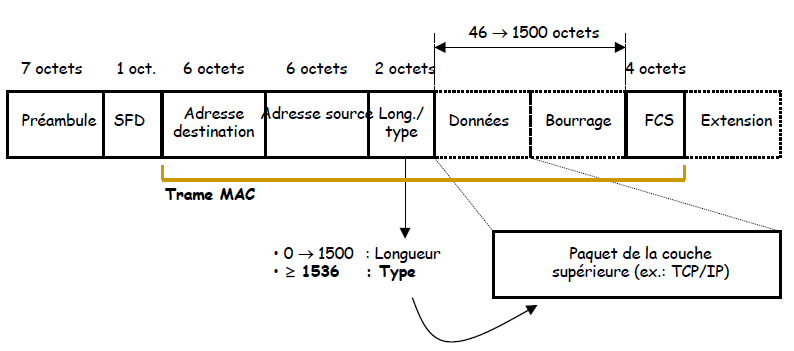

# Couche 2 : Liaison
## Principes 
L'adresse MAC (Media Access Control) est l'adresse physique d'une carte réseau (Ethernet, wifi...) cette adresse est codée sur 6 octets en paire de deux chiffres hexadécimaux séparés par des deux-points.
Les trois premiers octets de l'adresse correspondent à un constructeur, la deuxième partie de l'adresse correspond à la carte.

| Adresse | Fabriquant |
|---------|---------|
|08:00:20:0a:15:db| Carte réseau Oracle Corporation|
|f0:1f:af:16:0f:df| Carte réseau Dell Inc.|
|00:07:cb:c4:e8:0c| Carte réseau Freebox SAS|

L'adresse MAC est normalement unique, mais ce n'est pas le cas, les constructeurs utilisent souvent des adresses déjà utilisées.

Certaines adresses MAC sont réservées 

| Adresse | Description |
|---------|---------|
|FF:FF:FF:FF:FF:FF |Adresse de broadcast Ethernet|
|00:00:00:00:00:00 |Adresse vide ou non attribuée|
|01:00:5E:xx:xx:xx |Adresse de multicast IPv4    |
|33:33:xx:xx:xx:xx |Adresse de multicast IPv6    |
|01:80:C2:00:00:00 |Adresse de « spanning tree » |
|00:00:5E:00:01:xx |Protocole VRRP               |

## La trame Ethernet

Champs de l'entête
- Préambule : 7 octets à 10101010 pour synchroniser les stations
- Start Frame delimiter (SFD) : 1 octet à 10101011 pour annoncer le début de la trame
- @MAC destination : 6 octets
- @MAC source : 6 octets
- Type : 2 octets indiquant le protocole de niveau 3
    - 0800 pour IPv4
    - 86DD pour IPV6
    - 0806 pour ARP
- Données : padding avec des zéros si taille < 46 octets
- Frame Check Sequence (FCS) : contient le CRC de la trame qui permet au destinataire d'en vérifier l'intégrité.

## Les commutateurs
Les commutateurs permettent d'interconnecter des équipements dans un même réseau. 
Il se charge de faire corrspondre l'adresse MAC de destination à un de ses ports.

## Domaine de diffusion
Domaine de diffusion : Espace logique d'un réseau informatique où n'importe quel ordinateur peut directement communiquer avec tous les autres du même domaine, sans devoir passer par un routeur.
Il s’agit donc de l’ensemble des machines qui recevront une trame de broadcast envoyée par l’une d’entre elles.

## VLAN
Un VLAN ou Virtual Local Area Network est un réseau informatique logique indépendant, sur un switch les ports peuvent être taggués avec un numéro de VLAN.
Si une machine est connecté sur un port taggué VLAN x(x étant un numéro), la machine ne pourra communiquer qu'avec les machines de son vlan.
Le routeur se charge du trafic entre les VLAN.

### Liaison TRUNK
Le TRUNK est une liaison unique permettant de faire passer plusieurs VLAN sur un même lien. Il se situe entre deux switchs, ou un switch et un routeur.
Pour fonctionner, le switch réencapsule la trame ethernet avec un tag VLAN. Le destinataire de la trame, un autre switch Dé-encapsule la trame en enlevant le tag Vlan. 

