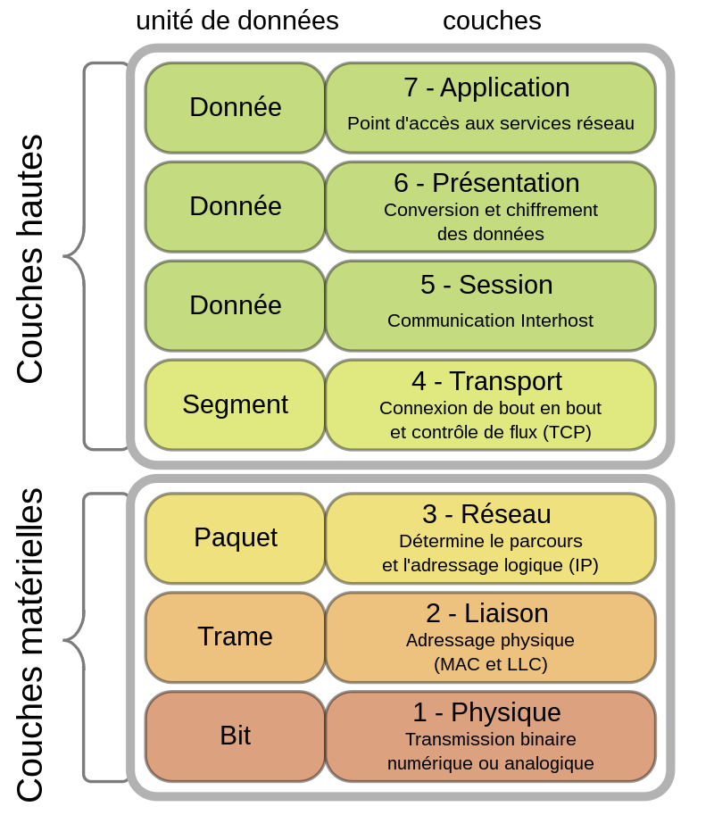
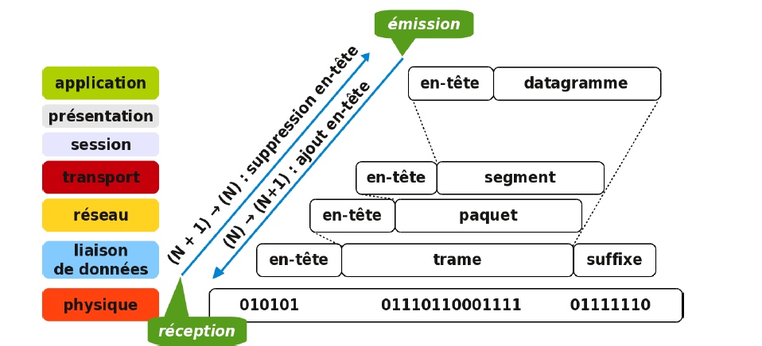
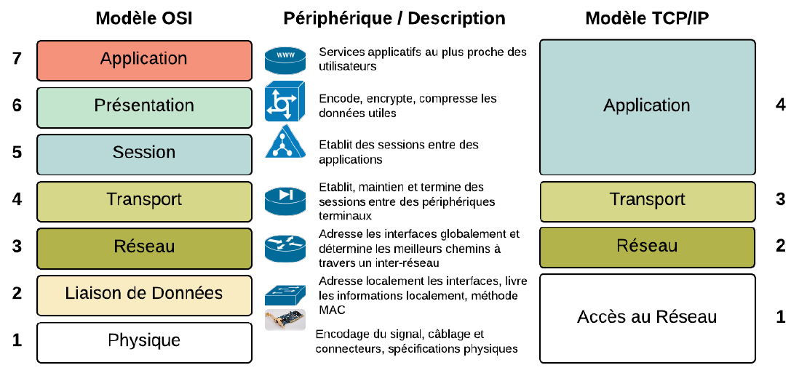

# Réseau
### Modèle OSI

Le modèle OSI (Open Systems Interconnection) est un modèle conceptuel qui caractérise et standardise les fonctions de communication d'un système de communication.
Le but est d'éviter le blocage des systèmes « propriétaires », de fournir un cadre général à respecter pour les intervenants dans le monde du réseau et de fournir des normes techniques.

Le modèle sépare le flux de données en sept couches, de l'implémentation physique et de la transmissions de bits à travers un médium de communication, 

Schéma : Wikipedia https://upload.wikimedia.org/wikipedia/commons/thumb/8/8d/OSI_Model_v1.svg/langfr-800px-OSI_Model_v1.svg.png

### L'encapsulation : 
Quand les données sont envoyées à la couche inférieure, chaque couche ajoute son entête/suffixe.
Quand les données remontent à la couche supérieure, chaque couche doit supprimer son entête/suffixe.

### Le Modèle TCP-IP 
Le modèle TCP-IP, adopté par Arpanet en 1983, est une simplification du modèle OSI.

