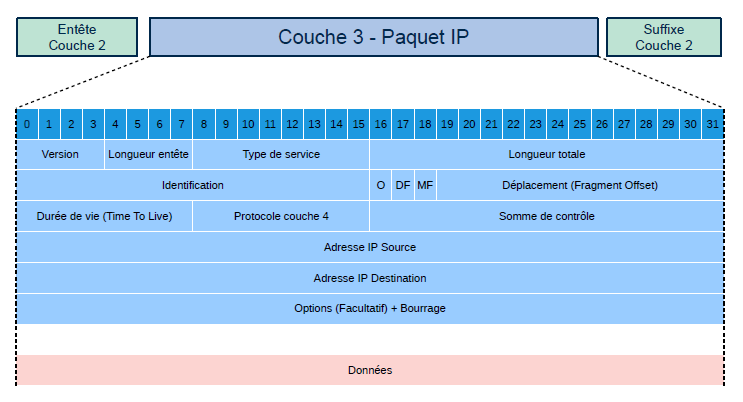

# Couche 1 : Réseau
## Principe IP v4 et masques de sous-réseaux

L'adresse IP est composée de 4 octets de 8 bits (0-255) soit 32 bits. Il existe 4 294 967 296 adresses maximum. 
L'adresse IP est associée à un masque, elle permet de couper l'adresse en deux partie un NetID et un HostID

Exemple : 
- Adresse IP :   192.168.0.1
- Masque :       255.255.255.0
- NetId  :       192.168.0
- HostId :       1

En notation CIDR 255.255.255.0 -> /24 (24 bits à "1")
L'association adresse/masque donne plusieurs informations importantes comme le nombre de machines adressables. 
Plus le masque est grand moins on à d'adresses.

L'adresse réseau est l'identifiant du réseau, on l'obtient quand tous les bits du HostId sont à 0

L'adresse de broadcast, utilisée pour communiquer à tous les membres du réseau s'obtient quand tous les bits du HostID sont à 1.

Exemple :
- Adresse IP :   192.168.0.1
- Masque :       255.255.255.0
- @ Réseau:      192.168.0.0
- @ Broadcast:   192.168.0.255

Le nombre de machines adressables est égal à 2^8 -2 = 254 

Les classes d'adresses : 
<table>
  <tr>
    <th>Classe</th>
    <th>Bits de départ</th>
    <th>Début</th>
    <th>Fin</th>
    <th>CIDR</th>
    <th>Masque</th>
    <th>Machines</th>
  </tr>
  <tr>
    <td>A</td>
    <td>0</td>
    <td>0.0.0.0</td>
    <td>127.255.255.255</td>
    <td>/8</td>
    <td>255.0.0.0</td>
    <td>16 777 214</td>
  </tr>
  <tr>
    <td>B</td>
    <td>10</td>
    <td>128.0.0.0</td>
    <td>191.255.255.255</td>
    <td>/16</td>
    <td>255.255.0.0</td>
    <td>65534</td>
  </tr>
  <tr>
    <td>C</td>
    <td>110</td>
    <td>192.0.0.0</td>
    <td>223.255.255.255</td>
    <td>/24</td>
    <td>255.255.255.0</td>
    <td>254</td>
  </tr>
  <tr>
    <td>D : Multicast</td>
    <td>1110</td>
    <td>224.0.0.0</td>
    <td>239.255.255.255</td>
    <td></td>
    <td></td>
    <td></td>
  </tr>
  <tr>
    <td>E : Réservée IANA</td>
    <td>1111</td>
    <td>240.0.0.0</td>
    <td>255.255.255.255</td>
    <td></td>
    <td></td>
    <td></td>
  </tr>
</table>

## Adresses réservées

Type d'adresses
- Adresses réservées
Adresses particulières, réservées au fonctionnement du réseau.
- Adresses privées
Adresses non routables, utilisables uniquement sur le réseau local. Uniques sur le réseau local, mais pas globalement. À choisir parmi les plages d'adresses privées en fonction du nombre de machines.
- Adresses publiques
Toutes les adresses qui ne sont ni réservées ni privées. Adresses routables et uniques sur Internet Fournies par le Fournisseur d'Accès Internet (FAI)

Adresses réservées
<table>
  <tr>
    <th>Adresse</th>
    <th>Début</th>
    <th>Fin</th>
    <th>CIDR</th>
    <th>Masque</th>
  </tr>
  <tr>
    <td>Adresse nulle</td>
    <td>0.0.0.0</td>
    <td>0.0.0.0</td>
    <td>/32</td>
    <td>255.255.255.255</td>
  </tr>
  <tr>
    <td>Broadcast général</td>
    <td>255.255.255.255</td>
    <td>255.255.255.255</td>
    <td>/32</td>
    <td>255.255.255.255</td>
  </tr>
  <tr>
    <td>Loopback</td>
    <td>127.0.0.0</td>
    <td>127.255.255.255</td>
    <td>/8</td>
    <td>255.0.0.0</td>
  </tr>
  <tr>
    <td>Apipa (auto-configurée)</td>
    <td>169.254.0.0</td>
    <td>169.254.255.255</td>
    <td>/16</td>
    <td>255.255.0.0</td>
  </tr>
  <tr>
    <td>Multicast</td>
    <td>224.0.0.0</td>
    <td>239.255.255.255</td>
    <td>/4</td>
    <td>240.0.0.0</td>
  </tr>
  <tr>
    <td>NAT à grande échelle (RIE)</td>
    <td>100.64.0.0</td>
    <td>100.127.255.255</td>
    <td>/10</td>
    <td>255.192.0.0</td>
  </tr>
</table>

Pour chaque classes(A,B et C) des adresses sont dites privées, elles sont utilisées pour un usage interne et privé. Ces adresses ne sont donc pas routables sur internet.
Elles sont donc unique localement (LAN ou WAN interne) mais à un niveau mondial plusieurs périphériques peuvent avoir la même adresse locale.

<table>
  <tr>
    <th>Classe</th>
    <th>Début</th>
    <th>Fin</th>
  </tr>
  <tr>
    <td>A</td>
    <td>10.0.0.0</td>
    <td>10.255.255.255</td>
  </tr>
  <tr>
    <td>B</td>
    <td>172.16.0.0</td>
    <td>172.31.255.255</td>
  </tr>
  <tr>
    <td>C</td>
    <td>192.168.0.0</td>
    <td>192.168.255.255</td>
  </tr>
</table>

## CIDR et subnetting

Le CIDR (Classless Inter-Domain Routing) remplace le mécanisme des classes 
Sa notation se fait en comptant le nombre de bits à 1 du masque 
Exemple : 
- En décimal : 255.255.255.0
- En binaire : 1111 1111.1111 1111.1111 1111.0
- En CIDR    : /24

Le CIDR permet d'utiliser des masques hors classe pour plus de granularité. (Variable Lenght Subnet Mask VLSM)
Quelques exemples : 
- /17 : 32766 hôte,
- /22 : 1022 hotes
- /30 : 2 hôtes
- /32 : 1 hôte

Le CIDR introduit la notion de subnetting et de suppernetting.

### Le subnetting 

Le subnetting consite à couper un réseau en plusieurs sous-réseaux. Le découpage se fait toujours de manière égale.
<table style="width:100%;text-align:center;">
  <tr>
    <td colspan="8">172.16.0.0/16</td>
  </tr>
  <tr>
    <td colspan="4" style="width:50%">172.16.0.0/17</td>
    <td colspan="4" style="width:50%">172.168.128.0/17</td>
  </tr>
  <tr>
    <td colspan="4" style="width:50%">172.16.0.0/17</td>
    <td colspan="2">172.16.128.0/18</td>
    <td colspan="2">172.16.192.0/18</td>
  </tr>
  <tr>
    <td colspan="4" style="width:50%">172.16.0.0/17</td>
    <td colspan="1">172.16.128.0/19</td>
    <td colspan="1">172.16.160.0/19</td>
    <td colspan="2">172.16.192.0/18</td>
  </tr>  
</table>

### Le supernetting

Utilisé par les FAI pour simplifier leur tables de routage, on fusionne des réseaux dans avec un masque plus petit.
<table style="width:100%;text-align:center;"> 
<tr>
    <td>192.168.0.0/24</td>
    <td>192.168.1.0/24</td>
    <td>192.168.2.0/24</td>
    <td>192.168.3.0/24</td>
  </tr>
  <tr>
    <td colspan="2">172.16.0.0/16</td>
    <td colspan="2">172.17.0.0/16</td>
  </tr>
  <tr>
    <td colspan="4">172.16.0.0/15</td>
  </tr>
</table>

## Le paquet IP

Champs de l'entête
- Version : 4 bits indiquant la version (4)
- Longueur de l'entête : 4 bits indiquant le nombre de mots de 4 octets composant l'entête
- TOS : 8 bits permettant d'activer la QOS
- Longueur totale : 16 bits indiquant le nombre total d'octets du paquet
- Identification : 16 bits identifiant les fragments d'un même paquet
- Don't fragment : 1 bit interdisant la fragmentation
- More fragments : 1 bit indiquant que d'autres fragments suivent
- Fragment offset : 13 bits indiquant la position du fragment en nombre de mots de 8 octets
- TTL : 8 bits indiquant la durée de vie d'un paquet
- Protocole : 8 bits indiquant le protocole de la couche supérieure (TCP, UDP, ICMP)
- Somme de contrôle : 16 bits, calculée à partir de l'entête
- @ source : 32 bits
- @ destination : 32 bits
- Options :
  - Security
  - Record route
  - Timestamp
  - Traceroute
  - ...
- Bourrage : Entre 0 et 7 bits à 0 pour obtenir une entête multiple de 32 bits

## ARP et ICMP

L'Adresse Resolution Protocol (ARP) permet à un équipement de récupérer l'adresse MAC d'une machine dont l'adresse IP est connue sur le même réseau local.
- 1: L'émetteur vérifie son cache ARP. S'il connait déjà l'adresse mac ET que l'entrée dans la table n'est pas périmée. Il renvoie l'adresse MAC à la couche IP
- 2: Sinon l'émtteur envoie une requète ARP en broadcast sur le réseau local pour demander qui possède l'adresse IP.
- 3: Le périphérique réseau qui reconnait son adresse IP réponds en envoyeant la réponse ARP avec son adresse MAC. Il met à jour sa table ARP avec l'adresse IP et MAC de l'émetteur.
- 4: L'émetteur reçoit la réponse, met à jour sa table ARP avec l'adresse IP et MAC puis renvoie l'adresse MAC à la couche IP.

L'ICMP est un protocole que les périphériques d'un réseau utilisent pour communiquer sur les problèmes de transmission des données.
Exemple : la requête ping.

## MTU et Fragmentation

Le Maximum Transmission Unit (MTU) est une valeur maximum de la taille d'un paquet IP. Il diffère en fonction du médium utilisé:
  - Ethernet normal : 1500 octets,
  - Ethernet jumbo:   jusqu'à 9000 octets,
  - PPPoE :           1492 octets,
  - ADSL :            1468 octets.

Dans ces cas là, le MTU est une limitation physique, il est impossible de l'augmenter.
Le MTU sert de base pour la négociation du Maximum Segment Size (MSS) dans l'établissement d'une connexion TCP.

Pour passer ces limites, les paquets IP plus grand que le MTU sont divisés en plusieurs segments, c'est la fragmentation.
Chaque fragment possède un entête avec deux informations:
  - Son emplacement dans le paquet -> Fragment Offset
  - S'il est le dernier fragment -> More Fragment (1 si oui, 0 si non)

Exemple avec le paquet suivant : 
<table>
  <tr>
    <td>Identification</td>
    <td>Longueur</td>
    <td>DF (Don't fragment)</td>
    <td>MF (More fragment)</td>
    <td>Fragment Offset</td>
  </tr>
  <tr>
    <td>345</td>
    <td>5140</td>
    <td>0</td>
    <td>0</td>
    <td>0</td>
  </tr>
</table>

On obtient les fragments suivants :
<table>
  <tr>
    <td>Identification</td>
    <td>Longueur</td>
    <td>DF (Don't fragment)</td>
    <td>MF (More fragment)</td>
    <td>Fragment Offset</td>
  </tr>
  <tr>
    <td>345</td>
    <td>1500</td>
    <td>0</td>
    <td>1</td>
    <td>0</td>
  </tr>
  <tr>
    <td>345</td>
    <td>1500</td>
    <td>0</td>
    <td>1</td>
    <td>185</td>
  </tr>
  <tr>
    <td>345</td>
    <td>1500</td>
    <td>0</td>
    <td>1</td>
    <td>370</td>
  </tr>
  <tr>
    <td>345</td>
    <td>700</td>
    <td>0</td>
    <td>0</td>
    <td>555</td>
  </tr>
</table>

Attention, L'offset est calculé en mot de 8 bits ! 

Attention, un fragment possède une entête de 20, donc il n'y a que 1480 octets du paquet d'origines.
Dans l'exemple en haut on a 1480+1480+1480+700 = 5140

## Routage et NAT
- Il s'agit du mécanisme qui permet de déterminer le chemin que doivent suivre les paquets pour arriver à destination, un équipement assurant la fonction de routage prend en charge le réacheminement des paquets qui ne lui sont pas destinés.
- Le routage se fait pas à pas (hop by hop). C'est à dire que le routeur détermine à quel voisin transmettre le paquet grâce à sa table de routage.
- La gestion du flux et des erreurs est repoussée aux extrémitées grâce au protocole TCP.
- Une machine ordinaire (linux ou windows) peut être un routeur.
  
### Table de routage
Chaque machine contient une table de routage, elle indique ce qu'il faut faire de chaque paquet en fonction de l'adresse destinataire: 
<table>
  <tr>
    <th>Réseau</th>
    <th>Masque</th>
    <th>Passerelle</th>
    <th>Interface</th>
  </tr>
  <tr>
    <td>0.0.0.0</td>
    <td>0.0.0.0</td>
    <td>10.189.250.249</td>
    <td>ens0p0</td>
  </tr>
  <tr>
    <td>10.189.250.0</td>
    <td>255.255.255.0</td>
    <td>-</td>
    <td>ens0p0</td>
  </tr>
  <tr>
    <td>127.0.0.0</td>
    <td>255.0.0.0</td>
    <td>-</td>
    <td>lo</td>
  </tr>
</table>

L'utilisation de cette table se fait du masque le plus long (ici : 255.255.255.0) au masque le plus petit (ici : 0.0.0.0)
Pour chaque ligne, Il faut effectuer un ET logique entre
l'adresse destinataire et le masque.

Si le résultat est égal à l'adresse réseau, la ligne doit être utilisée :
- soit en envoyant le paquet à la passerelle si elle est présente.
- soit directement sur l'interface.

### NAT
Du fait du manque d'adresse IP V4 publiques, la translation d'adresses a été mis en place.

En NAT statique, le routeur remplace l'adresse IP de la machine par une adresse publique donnée par le FAI.
En NAT dynamique, on utilise le numéro de port TCP ou UDP pour partager une seule adresse IP publique entre plusieurs machines qui possèdent des IP différentes 

#### Nat Sortant (SNAT)
Le NAT sortant change uniquement l'adresse IP du périphérique local avec l'IP publique attribuée par le FAI.
Le problème est que si deux périphériques utilisent le même port, le routeur ne saura pas vers qui renvoyer le paquet.

#### NAT/PAT (Network Adress Translation/ Port Adress Translation)
Avec le NAT/PAT il y a une translation d'adresse (@ IP privée-> @ IP publique) mais aussi une translation de port au niveau du routeur.
Quand le paquet arrive au routeur, il change le port et l'enregistre dans une table. Ainsi le routeur sait exactement à qui envoyer le paquet retour.

#### NAT entrant (DNAT) ou Redirection de port (Port forwarding)
Dans le cas ou une machine souhaite se connecter sur un serveur, elle connait uniquement l'adresse IP publique et le numéro de port et non l'ip et le port du serveur. 
Au niveau du routeur une règle est faite pour transférer les paquets avec un port précis vers une machine locale précise.

## Principes IP v6

Une adresse IP V6 est composée de 16 octets, soit un total de 128 bits.
Elle est coupée en 8 blocs de 4 chiffres hexadécimaux.
En IP V6 :
- Pas de NAT, une adresse unique par machine
- Pas de broadcast, remplacé par du multicast
- Pas d'ARP, il est remplacé par la découverte de voisins
- Configuration automatique
- Simplification des entêtes
- QOS intégrée

  L'adresse est découpée en deux partie
  - Un HostID de 64 bits
  - Un NetID de 64 bits

En mode autoconfiguration, l'hostID correspond à l'adresse MAC du périphérique, celle-ci est coupée à son milieu et la sequence hexadécimale FF FF est ajouté au milieu.
Exemple: 
- Adresse MAC : 1C 3E 84 1E 4E E6
- HostID:       1C 3E 84 FF FF 1E 4F E6

Le NetID est demandé au routeur grâce à une requête ICMP v6.
