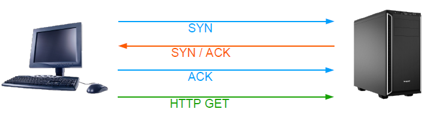

# Couche 4 : Transport

## TCP : Transmission Control Protocol

### Généralités
Le protocole TCP introduit la notion de port TCP (0->65535)
Il assure le transport fiable des données en controllant si les données sont erronnées ou non reçues, dans ces cas, le protocole redemande ces données.

Il fonctionne en mode connecté, ordonné et bi-directionnel.
Le TCP est utilisé pour le HTTP, FTP, SMB...

### Les ports
Les ports viennent s'ajouter à l'adresse IP pour créer un couple appelé "Socket TCP", il permet d'identifier un canal de communication sur une machine.
Il existe plusieurs types de ports :
  - Les ports connus de 0 à 1023 : ils sont reservés à certaines application (HTTP: 80)
  - Les ports enregistrés, de 1024 à 49151
  - Les ports dynamiques ou privés , de 49152 à 65535 

### Ouverture de session (3 way handshake)
- Pour ouvrir une session, la machine envoie un paquet avec le drapeau SYN (synchronisation) à 1.
- Le serveur répond avec un accusé de réception ACK (acknoledge) ainsi que le drapeau SYN à 1
- La machine confirme la connexion avec un ACK 
- La session TCP est ouverte
 

### Numéro de séquence
Le TCP fonctionne en mode connecté, il utilise un numéro de séquence pour tracer les envois, si un segment manque il est renvoyé :

### Fermeture de session 
Pour fermer une session TCP :
- une des machine envoie un paquet avec le drapeau FIN à 1.
- L'autre machine envoie un accusé de reception ACK ainsi que le drapeau FIN à 1.
- La première machine renvoie donc un paquet ACK pour confirmer.
- La session est cloturée.

### Fenêtre TCP glissante ou coulissante
Envoyer un ACK après chaque paquet n'est pas efficace, un fenêtre indique le nombre d'octets que l'on peut transmettre avant de devoir recevoit un ACK pour confirmer la réception.

La valeur peut être négociée (comme sur linux) ou imposée (Windows)

## L'entête TCP

Port source : 16 bits
- Port destination : 16 bits
- Numéro de séquence : 32 bits permettant de suivre la progression des
échanges
- Numéro d'acquittement : 32 bits indiquant le prochain numéro de
séquence attendu
- Taille de l'entête : 4 bits indiquant la longueur de l'entête en mots de 4 octets
- Drapeaux :
  - ECN : Signale de la congestion
  - URG : Signale la présence de donnée urgentes, localisation donnée par le pointeur de donnée urgente
  - ACK : Acquittement de la bonne réception des données
  - PUSH : Indique au récepteur de délivrer les données aux couches supérieures sans attendre le remplissage des buffers
  - RST : Réinitialisation de la connexion
  - SYN : Demande de connexion
  - FIN : Fin de l'échange
-  Fenêtre : 16 bits indiquant le nombre d'octets à recevoir avant acquittement
- Somme de contrôle : 16 bits, calculée à partir de l'entête et des données
- Pointeur de données urgentes : 16 bits indiquant la position des données urgente

## UDP
### Généralités
Le protocole UDP introduit la notion de port UDP (0->65535).
Il réduit le traitement au maximum en fonctionnant en mode non connecté. 

Quand un datagramme arrive, il n'y a pas de vérification, pas d'accusé de réception ni de controle de flux. 
Dans le cas ou un datagramme manque, il n'y a pas de réémission.

L'UDP est utilisé dans les protocoles suivants :
- DNS
- DHCP
- SNMP
- TOIP
- ...
- 
### Les ports
Les ports viennent s'ajouter à l'adresse IP pour créer un couple appelé "Socket UDP", il permet d'identifier un canal de communication sur une machine.
Identique au TCP

## L'entête TCP

## QUIC
Le QUIC est un protocole créé par Google et repris par l'IETF en 2013. Il a pour objectif de remplacer le TCP.

Il fonctionne sous UDP mais en mode connecté, il fusionne le transport et le chiffrement. C'est un protocole détaché de l'OS, géré directement par l'application.

## Quelques ports communs : 
| Service | Port               |
|:-------:|:------------------:|
| DNS     | 53 / UDP, 53 / TCP |
| SSH     | 22 / TCP           |
| HTTP    | 80 / TCP           |
| HTTPS   | 443 / TCP          |
| FTP     | 20 / TCP, 21 / TCP |
| POP3    | 110 / TCP          |
| IMAP    | 143 / TCP          |
| SMTP    | 25 / TCP           |
| LDAP    | 389 / TCP          |
