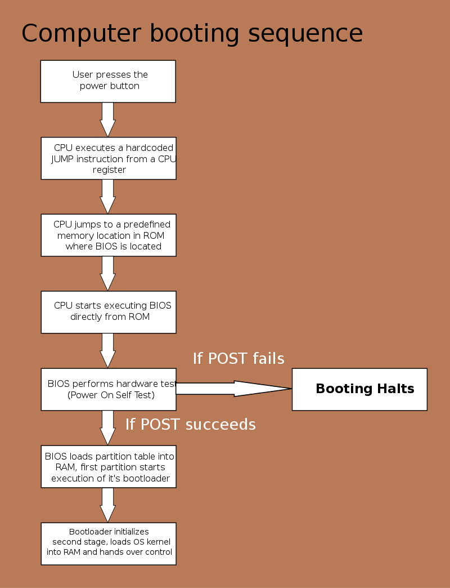
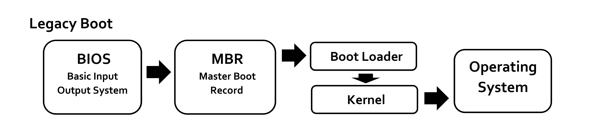

# Démarrage d'une machine

La séquence de démarrage décrite est valable pour les ordinateurs possédant un processeur d'architecture x86-64.
Elle correspond à un démarrage à froid. Dans le cas d'un démarrage à chaud, certaines étapes ne sont pas executées (Ex: Découverte des périphériques)

## Démarrage par un BIOS

Lors du démarrage du PC, le processeur est démarré en mode réel (C'est à dire qu'il n'utilise pas d'adresses virtuelles, il utilise les adresses physiques)
En mode réel, la mémoire est segmentée.

Une fois démarré, et prêt à exécuter des instructions, le processeur charge en mémoire ce qu'on appelle le "reset vector".
Le reset vector est une adresse mémoire hardcodée dans le processsur qui pointe vers les premières instructions que le processeur doit exécuter après son démarrage.
Pour une architecture x86, l'adresse est : FFFF0000:FFF0 
Le registre CS (Code segment) est à FFFF0000, et le registre IP (Instruction Pointer) à FFF0

Cette adresse mémoire contient une instruction jump (jmp) qui fait sauter l'exécution à la première instruction du BIOS.

Le BIOS procède ensuite au POST (Power-On Self-Test) où il va réaliser un certain nombre d'opérations:
- Tester les registres du processeur
- Vérifier l'intégrité du code du BIOS
- Vérifier certains composants basiques ( Timers, DMA (Direct Memory Access))
- Initialiser la mémoire vive, et la tester
- Découvrir et identifier les différents périphériques connectés (PCI, USB, SATA, IDE)

Une fois le POST réalisé, le BIOS va chercher parmis les périphériques découverts un périphérique de mémoire non volatile (Disque Dur, SSD, Clé USB) jusqu'à en trouver un qui est bootable.
Cette recherche se fait en suivant le boot order qui peut être configuré dans le BIOS par l'utilisateur.
La machine peut également booter sur un OS à travers un réseau pour exécuter un OS se trouvant sur un serveur distant (PXE).

Une fois un périphérique bootable trouvé, le BIOS charge son code exécutable dans la mémoire vive à l'adresse 0000:7C00.
La dernière instruction du BIOS est un jmp vers la première instruction du MBR/GPT.
A noter qu'un BIOS ne peut détecter que des tables MBR.

Le MBR/GPT va chercher une partition active bootable dans sa table, une fois trouvée, il chargle le code du boot sector (Volume Boot Record ou VBR) de la partition en question, et l'exécute.

A partir de là, l'OS prend le relais.

## Démarrage par un UEFI

- SEC (Security Phase): Initialisation d'une mémoire temporaire (on utilise le cache CPU comme étant de la RAM)
- PEI (Pre-EFI Initialisation): Découverte et initialisation du hardware, et notemment de la RAM
- DXE (Driver Execution Environment): Lancement de divers modules, dont le BDS
 - BDS (Boot Device Select): Initialisation des périphériques bootables
- TSL (Transient System Load): Stage intermédiaire avant la prise en main par l'OS, c'est à la fin de ce stage que le bootloader de l'OS est exécuté
- RT (Runtime): L'UEFI donne la main à l'OS, mais ce dernier peut continuer à utiliser ses fonctionnalités (l'UEFI définit certaines fonctions que l'OS peut utiliser)

Contrairement au BIOS, l'UEFI ne se base pas sur les secteurs de boot pour le démarrage de l'OS.
Un boot manager intégré fait la liste des boot loaders trouvés sur les disques.
Les boot loaders sont des fichiers portant l'extension ".efi" et dont le chemin d'accès est standardisé:
PARTITION_SYSTEME_EFI/efi/boot/<NOM>.efi
Le boot loader est ensuite chargé de démarrer le système d'exploitation.

A noter qu'un UEFI peut démarrer en mode CSM (Compatibility Support Module), afin de suivre la séquence de boot d'un BIOS classique dans le cas de l'utilisation d'un vieil OS.

## Différences entre BIOS et UEFI

### BIOS
Basic Input/Output System
Il a deux rôles principaux:
- Assurer le démarrage de la machine
- Fournir des services à l'OS sous la forme d'interruptions

Les interruptions du BIOS sont des "fonctions" que l'OS peut appeler pour interagir directement avec le matériel de manière basique sans avoir besoin de pilotes spécifiques.

 Cependant, les interruptions ne sont plus utilisées par les OS de nos jours à cause de plusieurs raisons:
 - Les interruptions ne peuvent s'exécuter que si le processeur est en mode réel. Dans le cas d'un appel à une interruption, il faut donc : Passer du mode protégé au mode réel, exécuter l'interruption, repasse en mode protégé, ce qui est long.
 - Le BIOS étant lent, le temps d'exécution de ces interruptions est trop élevé pour une utilisation pratique dans un OS moderne.
 - Les interruptions peuvent dépendre du BIOS utilisé, certines fonctionnalités peuvent changer d'un constructeur à un autre, et leur implémentatio peut parfois être buggée

### UEFI
Unified Extensible Firmware Interface

Remplace le BIOS dans les machines "modernes" (années 2000)
Il a les même rôles que le BIOS, mais contrairement à lui, il possède plusieurs avantages:
- Possibilité de booter sur un disque utilisant une table de partitions GPT
- Possibilité d'utiliser une interface graphique une fois dans les menus de l'UEFI
- Le processeur n'est pas limité au mode réel, et peut donc tourner en 32 ou 64 bits
- La programmation de l'UEFI peut se faire en C (contrairement au BIOS qui est écrit en assembleur)
- Il possède un shell utilisable

L'UEFI offre des fonctions appelées "services" qui peuvent être appelées par l'OS.

Une fonctionnalité bien connue de l'UEFI est le Secure Boot qui permet d'empêcher le chargement de bootloaders d'OS non signés. Ce qui avait à l'époque posé des soucis pour les distributions Linux.

## Différences GPT et MBR

## Un mot sur le PXE
