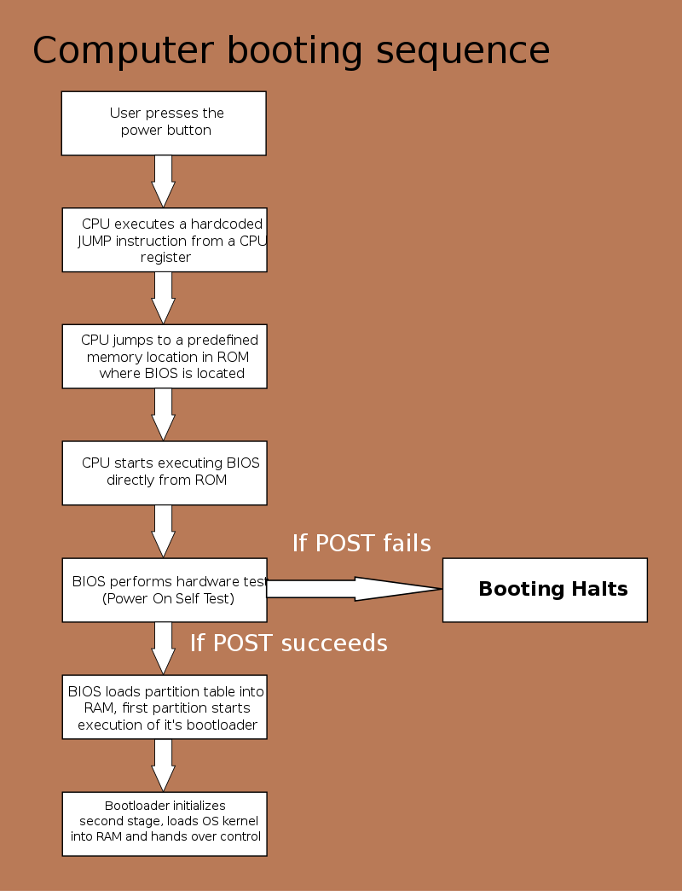

# Démarrage

## Démarrage par un BIOS

Lors du démarrage du PC, le processeur est démarré en mode réel (C'est à dire qu'il n'utilise pas d'adresses virtuelles, il utilise les adresses physiques)
En mode réel, la mémoire est segmentée.

Une fois démarré, et prêt à exécuter des instructions, le processeur charge en mémoire ce qu'on appelle le "reset vector".
Le reset vector est une adresse mémoire hardcodée dans le processeur qui pointe vers les premières instructions que le processeur doit exécuter après son démarrage.
Pour une architecture x86, l'adresse est : FFFF0000:FFF0 
Le registre CS (Code segment) est à FFFF0000, et le registre IP (Instruction Pointer) à FFF0

Cette adresse mémoire contient une instruction jump (jmp) qui fait sauter l'exécution à la première instruction du BIOS.

Le BIOS procède ensuite au POST (Power-On Self-Test) où il va réaliser un certain nombre d'opérations:
- Tester les registres du processeur
- Vérifier l'intégrité du code du BIOS
- Vérifier certains composants basiques ( Timers, DMA (Direct Memory Access))
- Initialiser la mémoire vive, et la tester
- Découvrir et identifier les différents périphériques connectés (PCI, USB, SATA, IDE)

Une fois le POST réalisé, le BIOS va chercher parmis les périphériques découverts un périphérique de mémoire non volatile (Disque Dur, SSD, Clé USB) jusqu'à en trouver un qui est bootable.
Cette recherche se fait en suivant le boot order qui peut être configuré dans le BIOS par l'utilisateur.
La machine peut également booter sur un OS à travers un réseau pour exécuter un OS se trouvant sur un serveur distant (PXE).

Une fois un périphérique bootable trouvé, le BIOS charge son code exécutable dans la mémoire vive à l'adresse 0000:7C00.
La dernière instruction du BIOS est un jmp vers la première instruction du MBR/GPT.
A noter qu'un BIOS ne peut détecter que des tables MBR.

Le MBR/GPT va chercher une partition active bootable dans sa table, une fois trouvée, il chargle le code du boot sector (Volume Boot Record ou VBR) de la partition en question, et l'exécute.

A partir de là, l'OS prend le relais.

