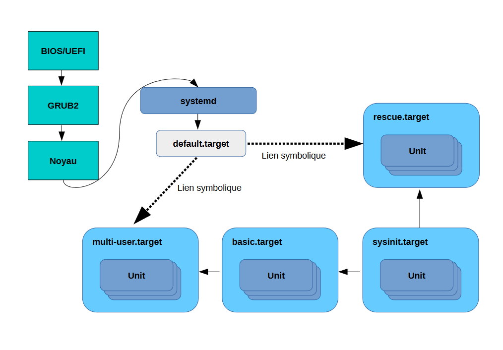

# Démarrage Linux

Le démarrage décrit est celui d'une distribution Linux présente sur une machine possédant un UEFI

Après ses vérifications, l'UEFI charge le bootloader (en général GRUB => grubx64.efi).
Ce dernier est chargé de détecter automatiquement les OS présents, et demande à l'utilisateur quel OS choisir dans le cas où plusieurs sont trouvés.
GRUB permer également de modifier les paramètres de démarrage.

Une fois l'OS sélectionné, son noyau (sous forme compressé) est chargé.

Un petit programme est chargé de le décompresser dans la RAM, il démarre ensuite son gestionnaire de mémoire (pagination), détecte le type de CPU, puis démarre la noyau via la fonction start_kernel().
Le noyau va alors initialiser un certain nombre de choses, parmi lesquelles le démarrage du processus "Init", et le montage de la partition /root dans la RAM.
A ce stade, tout est encore chargé en RAM dans ce qu'on appelle un "Initial RAM Disk" ("initrd" ou "initramfs"), c'est une zone de la RAM que l'OS utilise comme une zone du disque dur.

Une fois que le processus Init est lancé, le noyau entre dans un état d'attente (Il attend des appels de fonctions).

Le processus "Init" est chargé du reste du démarrage (montage des répertoires sur le disque dur, démarrage d'autres processus).
Il est le premier à être lancé au démarrage, et le dernier à se terminer lors d'un arrêt.

Historiquement, suivant les distributions, les processus "init" étaient différents.
De nos jours, le processus "init" le plus utilisé est "systemd".
Son but est de démarrer l'espace utilisateur, et de lancer les processus utilisateur.

## systemd
Systemd est le système d'initialisation utilisé par les distributions récentes, il intégre de base de nombreux services:
- journalctl (gestionnaire de logs)
- Networkmanager (gestionnaire de réseau)
- dbus (gestionnaire de communication inter-processus)
- timesync (gestionnaire du temps)
- pam (gestionnaire de l'identification)

Il se base sur un système d'unités.
Chaque unité regroupe des objets (programmes) utiles pour le démarrage et la gestion du système.
3 états sont possibles pour ces unités : 
- Actif
- Inactif
- En "transition" entre inactif et actif

Quelques unités disponibles :
- Services (Démarrage et contrôle des services et processus)
- Sockets (Gestion des sockets IPC et réseau)
- Périphériques (Gestion des périphériques)
- Montage (gestion des points de montage)
- Montages automatiques
- Timers
- Swap

Les unités sont chargées et exécutées au moment du démarrage dès qu'elles sont requises.
Lors du démarrage, systemd va démarrer les unités qui corresondent à la cible de démarrage (target)
Plusieurs cibles sont possibles (Ex : basic, multi-user, rescue, ...)

## Schéma simplifié

