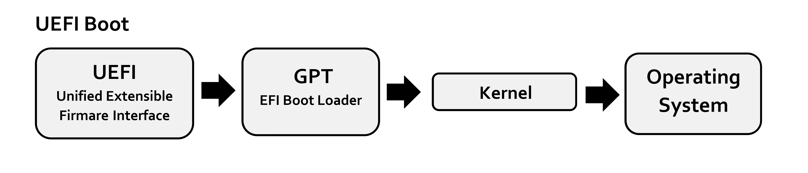

# Démarrage

## Démarrage par un UEFI

- SEC (Security Phase): Initialisation d'une mémoire temporaire (on utilise le cache CPU comme étant de la RAM)
- PEI (Pre-EFI Initialisation): Découverte et initialisation du hardware, et notemment de la RAM
- DXE (Driver Execution Environment): Lancement de divers modules, dont le BDS
 - BDS (Boot Device Select): Initialisation des périphériques bootables
- TSL (Transient System Load): Stage intermédiaire avant la prise en main par l'OS, c'est à la fin de ce stage que le bootloader de l'OS est exécuté
- RT (Runtime): L'UEFI donne la main à l'OS, mais ce dernier peut continuer à utiliser ses fonctionnalités (l'UEFI définit certaines fonctions que l'OS peut utiliser)

Contrairement au BIOS, l'UEFI ne se base pas sur les secteurs de boot pour le démarrage de l'OS.
Un boot manager intégré fait la liste des boot loaders trouvés sur les disques.
Les boot loaders sont des fichiers portant l'extension ".efi" et dont le chemin d'accès est standardisé:
PARTITION_SYSTEME_EFI/efi/boot/<NOM>.efi
Le boot loader est ensuite chargé de démarrer le système d'exploitation.

A noter qu'un UEFI peut démarrer en mode CSM (Compatibility Support Module), afin de suivre la séquence de boot d'un BIOS classique dans le cas de l'utilisation d'un vieil OS.

