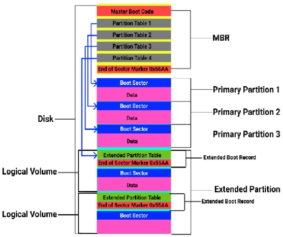

# Démarrage

## Différences GPT et MBR

### Le MBR
Master Boot Record

Il se situe tout au début du disque dur, d'une taille de 512 octets, il contient les informations sur la manière dont les blocks (ou secteurs) du disque sont organisés en partitions.
Il joue également le rôle de bootloader : c'est lui qui doit charger l'OS lors du démarrage.

La taille maximale qu'un MBR peut gérer est de 2 To.

L'organisation d'un MBR:
- Un bootstrap code qui est le code chargé de déterminer quelles partitions sont bootables, de les charger, et de les exécuter.
- Une table des partitions qui contient les informations sur la manière dont est partitionné le disque. Le MBR ne peut contenir des informations que sur 4 partitions au maximum. 

Pour augmenter le nombre de partitions possibles, on peut faire ce qu'on appelle des partitions étendues:
Dans une partition décrite dans le MBR, on va créer des "sous tables de partitions" qui décrivent l'arrangement de "sous-partitions". 

### Le GPT
GUID Partition Table

Permet de surpasser les limitations du MBR, et notemment la limitation de la taille maximale du disque (On passe de 2 To max à 75 Zo (Zettaoctet) max)

