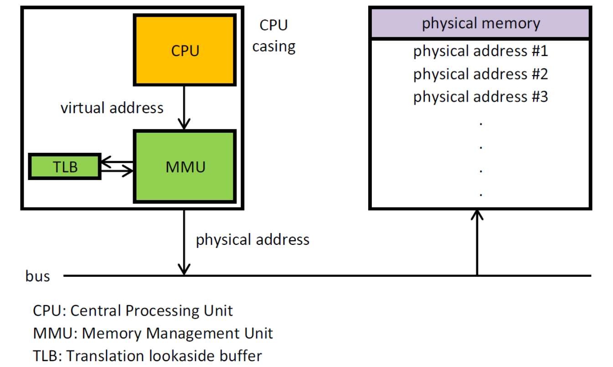

# Le matériel

Des infos en vrac sur quelques matériels à connaitre pour l'oral :

## Le MMU
Memory Management Unit

Composant présent en général dans le processeur, c'est lui qui est en charge de "traduire" les adresses mémoire virtuelles en adresses réelles.  

