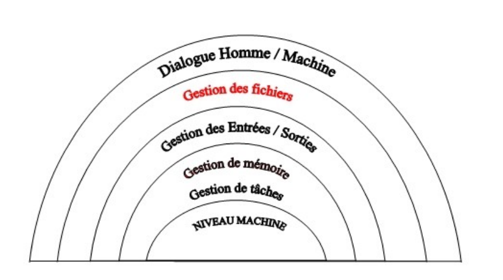

# Système d'exploitation

## Généralités

Un système d'exploitation est un ensemble de programmes qui servent d'interface entre le matériel et le logiciel.  
Le rôle de l'OS est de gérer les demandes d'accès au matériel qui sont faites par les différents programmes.  

Il gère notemment :
- Le dialogue homme/machine
- La gestion des fichiers
- La gestion des entrées/sorties
- La gestion de la mémoire
- La gestion des tâches (processus)
- La gestion du matériel

### Gestion du matériel

Un périphérique est un dispositif connecté à un ordinateur qui permet d'étendre ses fonctionnalités.  
On distingue trois types de périphériques:
- Périphériques d'entrée (Ex: souris, clavier, webcam, micro , ...)
- Périphériques de sortie (Ex: écran, imprimante, ...)
- Périphériques de stockage (Ex: disque dur, SSD)

Chaque périphérique possède un contrôleur, c'est le composant qui permet de piloter le périphérique en lui envoyant des instructions.  

Le système d'exploitation a deux missions : 
- Suivre l'état d'utilisation (libre ou réservé) des périphériques, et attribuer leur accès aux processus qui en ont besoin
- Le pilotage du périphérique via les pilotes (drivers) et le contrôleur.

Le pilotage du périphérique via le contrôleur peut se faire de deux manières:
- Programmed I/O: Le processeur envoie une demande au contrôleur, puis vérifie de temps en temps l'état de celui-ci pour savoir si l'opération est terminée
- Interrupt driven I/O : Le processeur envoie une demande au contrôleur, puis passe à l'exécution des autres processus. Lorsque l'opération est teminée, le contrôleur envoie une interruption. Le processeur interrompt ses activités sur les autres processus, et passe au traitement des résultats.

### Gestion des tâches

Le système d'exploitation s'occupe de créer, d'interrompre et de supprimer les processus.  
Pour ça il doit : 
- Réservier la mémoire
- Planifier l'exécution (ordonnancement)
- S'occuper des interblocages (il gère l'octroi des ressources suivant les disponibilités de cs dernières)
- Assurer les communications entre les processus

### Gestion de la mémoire

Le système d'exploitation dirige l'utilisation de la mémoire, c'est lui qui réserve les emplacements lorsqu'un processus le demande et qui les libère lorsque le processus n'en a plus besoin (Ex : Arrêt)  

Il garde en mémoire la liste des emplacements mémoire utilisés et libres.

Il s'occupe également de la gestion de la sécurité de la mémoire : Il réserve à chaque programme un espace d'adressage que lui seul peut manipuler.  
Toute tentative d'accès de la part d'un autre processus provoque l'arrêt immédiat du processus qui a tenté l'accès.

C'est également l'OS qui gère la pagination de la mémoire

### Gestion des fichiers

L'OS implémente un système de fichiers qui permet de stocker et manipuler ces derniers.

### Gestion du réseau

L'OS se charge de gérer les couches 1 à 4 du modèle OSI:
- Couches 1 et 2: C'est l'OS via le pilote qui demande au périphérique réseau de se charger de la traduction (signal vers données)
- Couches 3 et 4: Ce sont divers programmes présents dans l'OS qui se chargent du découpage en trames.

