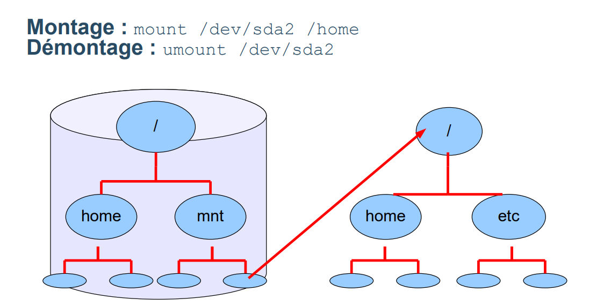
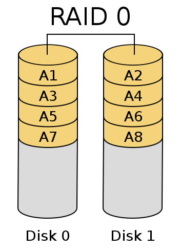
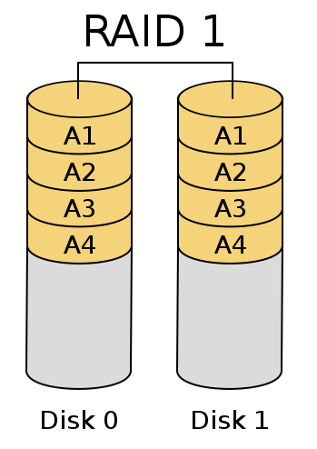
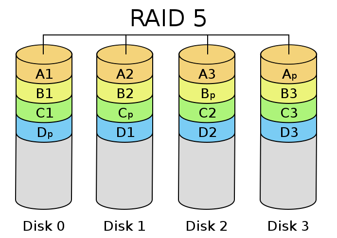
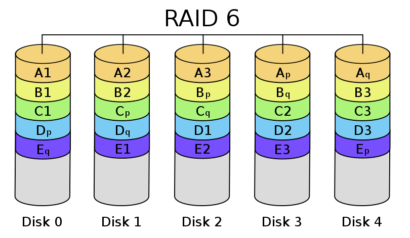
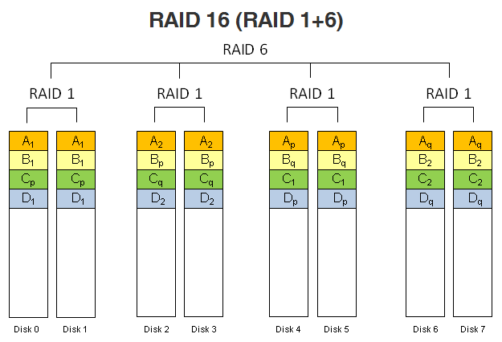
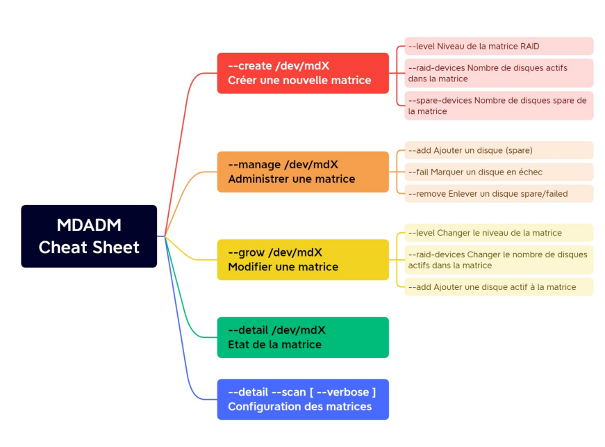
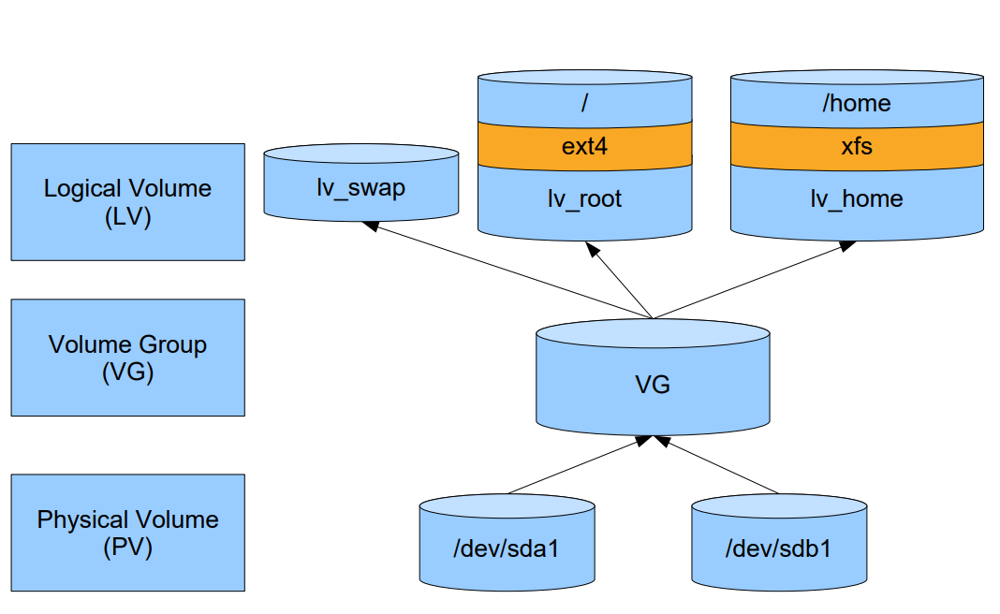

# Linux

## Gestion des disques

### Le partitionnement

Représentation:
- Disques : /dev/hda ou /dev/sda
- Partitions : /dev/sda1, /dev/sda2

La partitionnement : Création de régions sur la mémoire secondaire, c'est la première chose que l'on fait avant le formatage.  
Chaque partition est considérée comme étant un disque logique par l'OS.

On utilise la commande parted pour gérer le partitionnement

### Le formatage
C'est l'action d'installer un système de fichiers spécifique sur une partition, on utilise pour cela la commande mkfs

### Le montage
Le but est de rattacher une partition formatée au système de fichiers de l'OS.  
Pour ça on attache la racine ("/") de la partition à un répertoire du système de fichiers déjà actif.

Pour la gestion du montage, on utilise les commandes mount et umount.  
A noter que lors d'un reboot, les montages sont perdus.

Pour les pérénniser, on doit modifier le fichier /etc/fstab:
```
    .-------------------------------------- Partition à monter
    |         .---------------------------- Point de montage (Répertoire dans lequel sera monté la partition)
    |         |      .--------------------- Système de fichiers
    |         |      |     .--------------- Options de montage supplémentaires
    |         |      |     |     .--------- Dump du système de fichier , 1 = oui , 0 = non
    |         |      |     |     | .------- Ordre de vérification du système de fichiers lors du boot
    |         |      |     |     | |
/dev/sda1 /mnt/disk xfs defaults 1 2
```



## Le RAID

Redundant Array of Independent Disks : répartition des données sur plusieurs disques

Plusieurs types de RAID possibles : 
- Matériel : Un composant physique est affecté à la gestion des opérations, ce qui permet un allègement de la charge système
- Pseudo-matériel : C'est le contrôleur intégré au disque qui se charge des opérations, moins char qu'un RAID matériel, mais également un peu moins efficace en terme de performances (le contrôleur du disque doit alors s'occuper de l'accès + de la gestion du RAID)
- Logiciel : Le système d'exploitation se charge de la mise en place du RAID, c'est la méthode la moins onéreuse, cependant elle consomme un certain nombre de ressources du système

Il existe également plusieurs modes de RAID

### RAID 0
Les données sont réparties sur des disques différents sans parité.  
L'avantage est une amélioration de la performance (théoriquement on améliore la vitesse d'écriture/lecture d'un facteur égal au nombre de disques présents)  
Par contre, si un disque est perdu, toutes les données le sont également.

Il est plus utilisé dans le cas où les performances priment sur la sécurité des données



### RAID 1
Mirroring : Les données sont copiées sur les deux disques.  
Si l'un des deux disques est perdu, les données sont conservées, cependant on perd 50% du volume total des disques.  
Plus le nombre de miroirs est élevé, et plus la sécurité augmente, mais plus son coût devient rédhibitoire.

A noter que la migration d'un RAID 1 vers un RAID 0, 5 ou 6 est facile à mettre en oeuvre, le RAID 1 est donc une bonne solution de départ évolutive.



### RAID 5
Le raid 5 combine la méthode de volume agrégé par bandes comme le raid 0 et ajoute une parité, elle est incluse à chaque écriture et est répartie circulairement sur les différents disques.
Chaque bande est composée de N-1 blocs de données et d'un bloc de parité.

En cas de panne d'un disque, il manque soit une partie de données, soit le bloc de parité (ce qui est moins grave). Il est possible de reconstruire les données à partir des données restante et du bloc de parité.
La tolérance à la panne est d'un seul disque. 



### RAID 6
Le raid 6 est une évolution du raid 5 avec deux blocs de parité.
Cette solution est plus lente car il demande au système de calculer deux blocs de parité pour chaque données. 
Cependant, ce raid est plus sécurisé car il permet la perte de deux disques.



Tous ces différents RAID peuvent être combinés : Ex RAID 16 = Quatre RAID 1 sous un RAID 6



La gestion logicielle des RAID se fait via la commande "mdadm"



## Les LVM

Permet une couche d'abstraction entre l'espace physique et le système.  
On va pour cela créer des partitions virtuelles qui sont plus simples à gerer (ajout, extension, suppression) que des partitions physiques.  

Un LVM est composé de:
- Volumes physiques qui sont des disques ou partitions physiques
- Groupes de volumes = disques logiques
- Volumes logiques = partitions logiques



Etapes à suivre pour créer un volume logique :
- Créer un volume physique = pvcreate /dev/vda1
- Créer un volume group = vgcreate /dev/vda1 /dev/vda2
- Créer un volume logique = lvcreate -n NOM -L TAILLE NOM_VG
- Formater le volume logique = mkfs
- Monter le nouveau système = mount

On peut créer un snapshot d'un volume logique à l'aide de l'option --snapshot de la commande lvcreate
