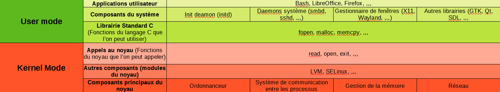

# Linux

## Généralités

GNU/Linux est une famille de systèmes d'exploitations open source basés sur le noyau Linux.  
GNU => Applications de l'OS  
Linux => Noyau

GNU/Linux est un os multi-tâche, multi-utilisateurs et multi-architecture (x86_64, arm, ...)

## Les distributions

Une distribution comprend :
- un noyau Linux
- un processus init (runit, OpenRC, ou plus récemment systemd)
- des outils et libraries GNU
- un serveur d'affichage (X.org, KWin, Mutter)
- un environnement graphique (KDE, GNOME, XFCE)
- un serveur de son (PulseAudio, PipeWire)

La plupart des applications fournies dans une distribution sont gratuites et open-source, cependant, certains drivers inclus peuvent être propriétaires.

Quelques exemples:
- Bureautique : Fedora, Ubuntu
- Entreprise : RedHat
- Sécurité : Kali Linux

## Le noyau Linux

Il a été créé en 1991 par Linus Torvalds.

Le noyau Linux est gratuit et open source, il est :
- monolithique : Les fonctionnalités fondamentales du noyau sont présentes dans un seul bloc de code (le noyau est plus rapide qu'un full modulaire)
- modulaire : Certaines fonctionnalités tels que les pilotes peuvent être chargés à la volée dans le noyau
- multi-tâche

Un avantage du noyau Linux est qu'on peut le compiler soi même en ne conservent à l'intérieur que les fonctionnalités qui nous intéressent. Cela se fait très simplement:

- Téléchargement du code source du noyau
- Récupération d'un fichier .config qui contient le configuration du noyau
- Utilisation de la commande make menuconfig qui permet de personnaliser la configuration
- Compilation du noyau via la commande make

Il est également disponible pour un grand nombre d'architectures (x86_64, arm64, MIPS, RISC, ...) contrairement au noyau Windows, ce qui lui permet d'être déployé sur un grand nombre de types de machines différentes (PC, smartphones, ...).

## Les environnements graphiques

Chaque programme possédant une interface graphique est un "client" d'un serveur d'affichage.
Ce serveur va recevoir les informations provenant du noyau (entrées du clavier, position de la souris, ...) et les dispatcher aux GUI (interfaces graphiques) des clients. Il donne également accès à un certain nombre de services.

Le serveur et le client communiquent à l'aide d'un protocole de communication.

