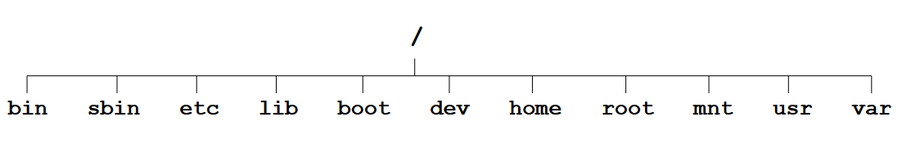
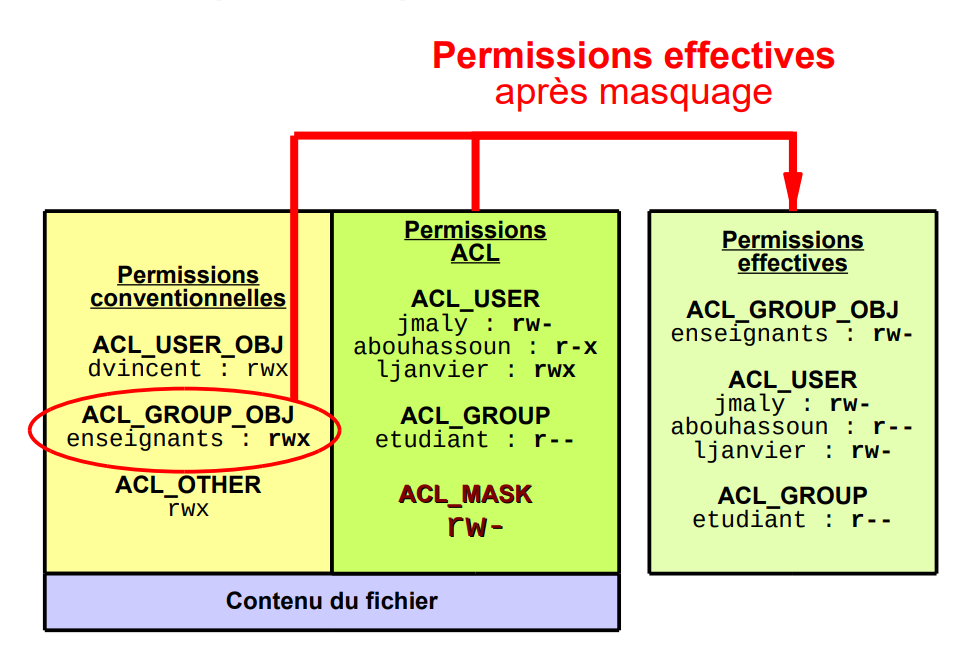

# Linux

## Système de fichiers

### L'arborescence
Organisation hiérarchique par arborescence unique.  
Nom de fichier : 255 caractères maximum, les noms de fichiers cachés commencent par un "." et les extensions sont indicatives.

Racine de l'arborescence : "/"

Chemin absolu : 
/var/log/blip.log

Chemin relatif:
./log/blip.log ou ../log.blip.log
. -> Répertoire courant
.. -> Répertoire parent

Chaque utilisateur possède un répertoire personnel situé dans /home qui porte son nom, et qui est le répertoire dans lequel il se trouve par défaut lors de sa connexion  
Ex: Utilisateur Blip a son répertoire dans /home/blip.  
Le symbole ~ désigne le répertoire personnel de l'utilisateur connecté.

Organisation standard de l'arborescence (Attention, elle peut varier suivant les distributions et machines)



- bin : Contient les exécutables
- sbin : Exécutables spécifiques aux administrateurs
- etc (editing text config): Fichiers de configuration
- lib : Bibliothèques du noyau, et bibliothèques partagées (fichiers .so pour shared objects (Equivalent des .dll sous Windows))
- boot : Fichiers nécéssaires au démarrage
- dev : Fichiers spéciaux des périphériques
- home : Répertoires des utilisateurs
- root : Répertoire du super utilisateur (root)
- mnt ou media : Points de montage (clé USB, ...)
- usr (unix system resources): Ressources système (Contient des programmes utilisés par les utilisateurs du système)
- proc : Contient des fichiers spéciaux des processus
- srv : Données de divers services (Ex: Apache)
- tmp : Fichiers temporaires

### Les fichiers

En UNIX, tout est fichier, voici quelques types de fichiers:
- Ordinaires (texte, image, ...)
- Répertoires
- Liens (logique = "raccourci" et physique = "pointeur")
- caractères / blocs (mémoire brute, disque physique, ...)

Chaque fichier possède un inode : c'est un identifiant unique à chaque fichier.

### Les liens symboliques

Comparables aux raccourcis sous Windows, le fichier pointe vers un autre fichier  
Si le fichier sur lequel le lien pointe est supprimé, le lien est cassé

### Les liens physiques

Le fichier pointe directement sur la zone mémoire d'un autre, il y a donc deux fichiers différents pour un même contenu.  
Le contenu du fichier est supprimé que lorsque tous les liens physiques qui pointent vers lui sont supprimés

### Informations sur un fichier

Lorsqu'on liste les fichiers avec ls -l, on peut voir plusieurs informations:
```
-rw-r--r--  1 g2a users  2109 jun 19 09:12 snatLog.tar.gz
```

- ``-rw-r--r--`` : Le type de fichier + droits de chaque entitée
- ``1`` : Nombre de liens physiques du fichier
- ``g2a``: Propriétaire du fichier
- ``users``: Groupe du fichier
- ``2109``: Taille du fichier en octets
- ``jun 19 09:12``: horodatage de la dernière modification du fichier
- ``snatLog.tar.gz``: Nom du fichier

#### Les permissions de base des fichiers

La première lettre correspond au type de fichier  
Fichiers classiques:
- "-": Fichier ordinaire
- "d": réperotire
- "l": Lien symbolique  
Fichiers spéciaux liés au fonctionnement d'un driver
- "c": Caractère (Lecture caractère par caractère) (Ex: Driver de lecture du clavier, la lecture se fait caractère par caractère)
- "b": Block (Lecture block par block (morceaux par morceaux)) (Ex: Lecture d'un fichier sur un disque dur)  
Fichiers spéciaux liés aux communications entre les processus
- "p": Tube nommé
- "s": Socket

Les droits dont définis pour 3 entités: le propriétaire (u), le groupe (g) et les autres (o)  
Jusqu'à 3 droits peuvent être affectés à chaque entité:
| Droit | Fichier   | Répertoire                   |
|-------|-----------|------------------------------|
| r     | Lecture   | Listage du contenu           |
| w     | Ecriture  | Ajout/Suppression de fichier |
| x     | Exécution | Traversée du répertoire      |

#### Définition initiale des droits d'un fichier

Le shell donne les droits suivants par défaut aux fichiers et répertoires nouvellement créés:
- Fichiers : rw-rw-rw
- Répertoires: rwxrwxrwx

En plus de ça, l'umask s'applique à tout nouveau fichier ou répertoire **créé ou copié**  
L'application des droits se fait en comparant l'umask et les droits par défauts.

Ex :
umask = u=rwx,g=rx,o=rx

Résultat:
- Fichier : rw-r--r--
- Répertoire: rwxr-xr-x

#### Permissions étendues d'un fichier

Des droits supplémentaires peuvent être affectés à un fichier ou répertoire:

##### s (SetUID ou SetGID)

Il peut être positionné sur le propriétaire ou le groupe.  
Il se superpose au droit x:
- S = s tout seul
- s = s + x

Effets:

| Entité       | Fichier                                                | Répertoire                                                                                                         |
|--------------|--------------------------------------------------------|--------------------------------------------------------------------------------------------------------------------|
| Propriétaire | Lancement du processus avec les droits du propriétaire | Ignoré                                                                                                             |
| Groupe       | Lancement du processus avec les droits du groupe       | Les nouveaux objets créés à l'intérieur du répertoire héritent du groupe de celui ci (Non rétroactif et récursif)  |

##### t (Sticky bit)

Il est positionné sur les autres (o)  
Il se superpose au droit x:
- T = t tout seul
- t = t + x

Effets:

Pas d'effet sur les fichiers  
Sur un répertoire, les objets contenus à l'intérieur ne peuvent être supprimés ou renommés que par leur propriétaire, le propriétaire du répertoire ou root.

#### Les ACL (Access Control List)

Ce sont des droits qui sont positionnés sur un objet (**droits discrétionnaires**)  
En plus des droits pour le paropriétaire et le groupe, on peut ajouter des droits ciblés pour un utilisateur ou un groupe en plus : La **granularité** est donc augmentée.  

Seuls petits bémols : Le paquet doit être insallé en plus (il n'est pas fourni de base avec les distributions Linuxà, et le système de fichiers doit être compatible.

Les ACL sont découpées en deux parties :
- Les permissions conventionnelles (propriétaire ACL_USER_OBJ, groupe ACL_GROUP_OBJ, autres ACL_OTHER)
- Les permissions ACL qui sont des permissions supplémentaires données pour un groupe (ACL_GROUP) ou un utilisateur (ACL_USER).

Les droits restent les mêmes : r, w et x

Un masque doit être précisé dans le cas où l'on ajoute des permissions de type ACL_USER ou ACL_GROUP.  
Ce masque s'applique aux droits des ACL_USER, ACL_GROUP et **ACL_GROUP_OBJ**.  
Il s'agit par défaut de la valeur la plus permissive hors propriétaire.



L'héritage des ACL dans un répertoire ne se fait que si il y a présence d'entrées par défaut : DEFAULT_ACL_USER et DEFAULT_ACL_GROUP.
Attention : **le retrait d'une règle par défaut n'est pas récursif !**

La manipulation des ACL se fait via les commandes setfacl et getfacl (PLus d'infos sur le chapitre des commandes Linux)

### Limitations de l'utilisation

On peut limiter l'utilisation de l'espace disque à l'aide du système de quotas.  
Cette limitation peut se faire par utilisateur, par groupe ou par projet (xfs seulement).  
Pour l'utiliser, il faut installer le paquet quota.x86_64.

Deux limites peuvent être données : la soft et la hard.  
La soft correspond à la limite à partir de laquelle une alerte sera notifiée à l'utilisateur / groupe.
La hard correspond à le limite maximale que l'utilisateur / groupe peut utiliser.

Il faut également que le disque soit monté avec une option supplémentaire :

- usrquota, grpquota pour ext4
- quota, gquota, prjquota pour xfs

Ex : 
```
- /dev/sda1 /home ext4 defaults,usrquota 1 1 pour Ext4
- /dev/sda1 /home xfs  rw,quota          0 0 pour XFS
```

#### Limitation par utilisateur

##### Ext4

- Création de l'index : quotacheck -vgum /home
- Activation des quotas : quotaon -av
- Modification du fichier : edquota utilisateur

##### XFS
xfs_quota -xc 'limit -u bsoft=400m bhard=500m user' /rep1/rep2

#### Limitation par groupe

##### Ext4

- Création de l'index : quotacheck -vgum /home
- Activation des quotas : quotaon -av
- Modification du fichier : edquota groupe

##### XFS
xfs_quota –xc 'limit –g isoft=100 ihard=150 group' /rep1/rep2

#### Limitation par projet (ou répertoire)

UNIQUEMENT SOUS XFS

- Création de l'ID du projet : echo "projetBlip:1" > /etc/projid
- Association du projet à un répertoire : echo "1:/home/test" > /etc/projects
- Ajout du projet dans le système de quotas : xfs_quota -xc 'project -s projetBlip' /home/test
- Mise en place des limites : xfs_quota -xc 'limit -p bsoft=4g bhard=5g projetBlip' <point de montage>
