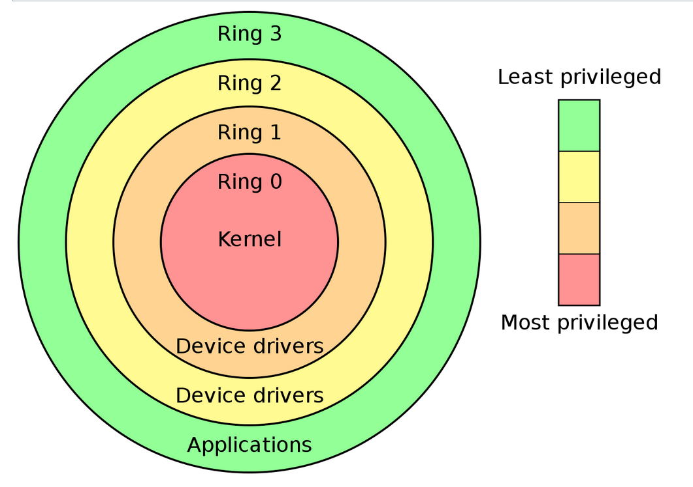

# Processeur

Un processeur peut tourner sous plusieurs "modes"

## Mode réel
En mode réel, il n'y a pas de mémoire virtuelle, le processeur accède à la mémoire via les adresses mémoire physiques.
On ne peut adresser que 1 Mo de mémoire vive.
Le processeur ne fonctionne que sur 16 bits.

C'était le mode par défaut utilisé sur les premiers processeurs de la famille x86.
Lorsqu'un PC démarre, le processeur est en mode réel.

## Mode protégé
Le mode protégé ajoute la notion de niveaux (ou anneaux "rings") de privilèges.  
Il y en a en tout 4 du plus privilégié au oins privilégié : 0, 1, 2 et 3

Le passage d'un niveau moins privilégié à un niveau privilégié se fait par l'appel de certaines instructions.

C'est à l'OS de mettre en oeuvre les niveaux de privilèges, par exemple, il décidera de faire tourner son noyau au niveau 0, les drivers au niveau 1 ou 2 et les applications au niveau 3.   

Ce système permet d'apporter une certaine sécurité : 
Un logiciel malveillant tournant au niveau 3 pourrait par exemple ne pas pouvoir faire appel à un driver tournant au niveau 2 pour pouvoir par exemple prendre le contrôle d'une webcam.

Le mode protégé apporte également la possibilité de paginer la mémoire.
